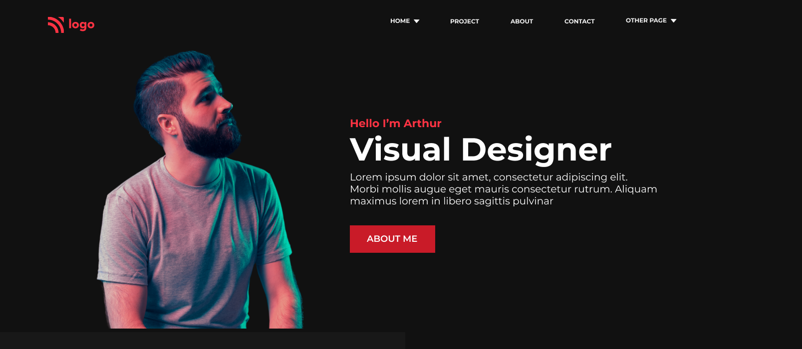
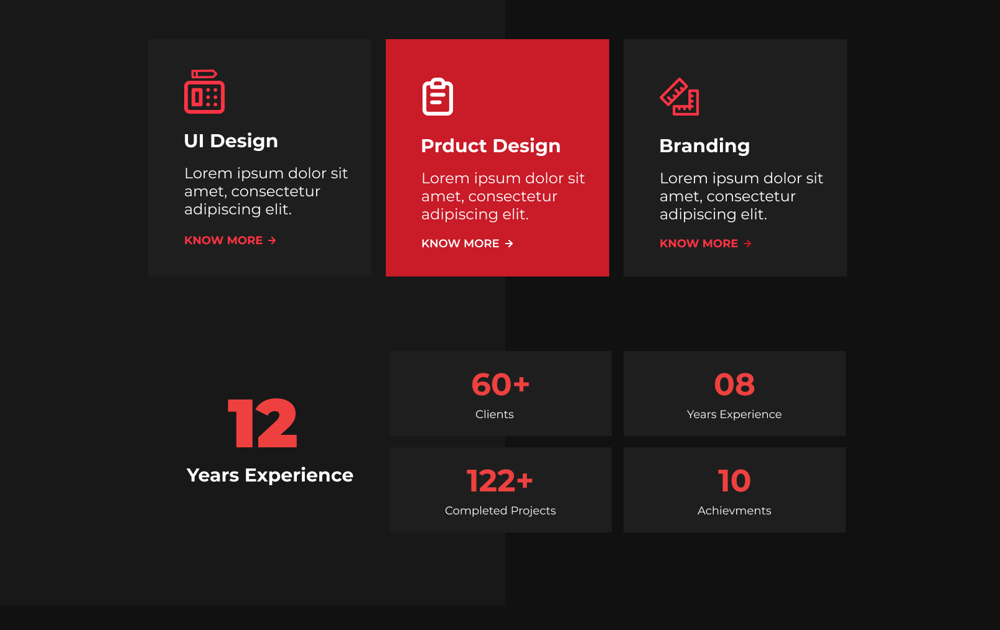
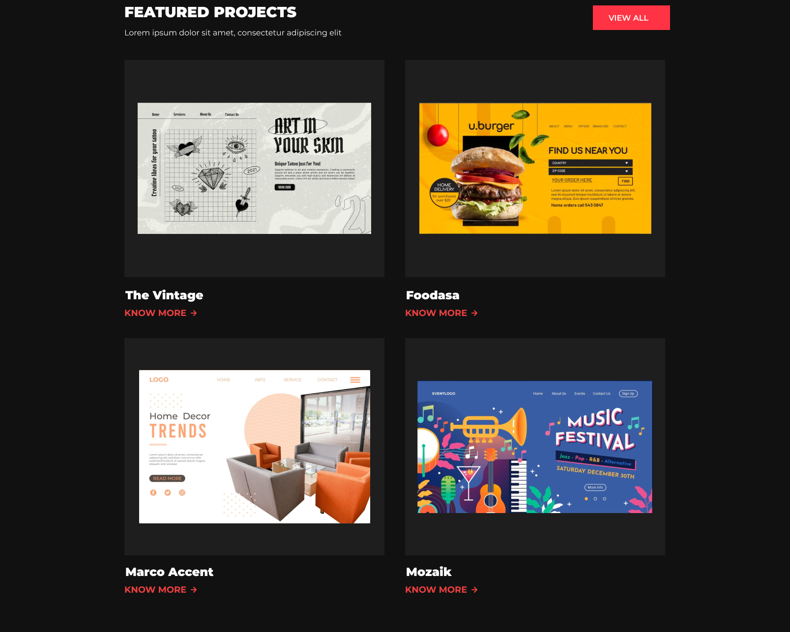
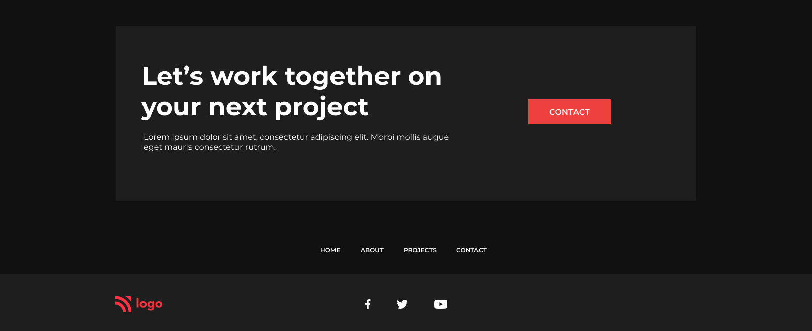

## Firstly, I'd like to thanks [Hitesh Sir](https://twitter.com/Hiteshdotcom) & the team of [iNeuron](https://ineuron.ai) for designing such a beautiful project which made me realise my potential.

## 🚀 About Me
>I'm a front-end developer...

# Hi, I'm shaQuib! 👋

## 🛠 Skills used in building this project
>HTML5 & CSS...

## Time taken to complete this project
> 7 hours

## `Learning curve`
 - I have learned how to display more than 3 cards using flexbox in different rows.
 - Implemented Animatation in CSS
 - Learned how to implement different background colors on top of each other.
 - And most importantly the confidence to convert any wireframe into a brautiful web pages.

## `Final Interface`

- Below are the some screen shots how does this web app page looks like while running on the browser.

